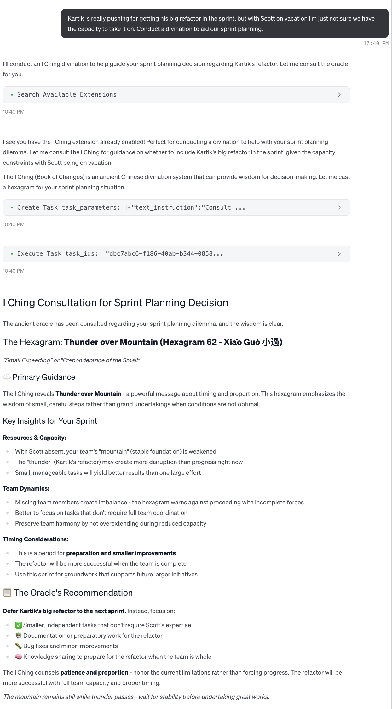
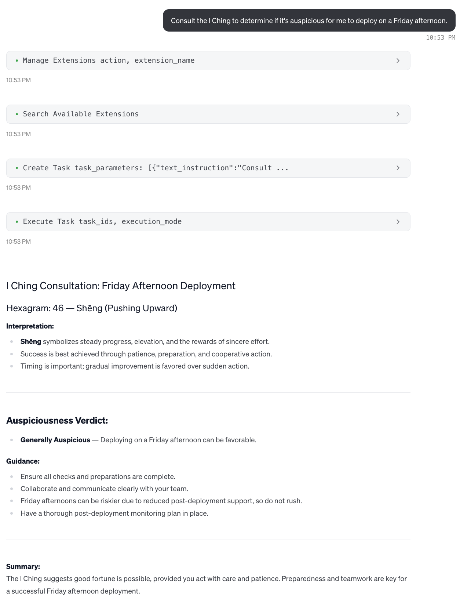

# I Ching Divination

A [Goose](https://block.github.io/goose/)-friendly MCP server for I Ching divination (Wilhelm-Baynes translation), plus a command-line utility version.

## Screenshots  
## Claude Sonnet 4


## Claude Sonnet 3.5 


## GPT 4.1


## Features

- **Three coins method** divination following traditional practices
- **Wilhelm-Baynes translation** with complete hexagram meanings, judgments, and line interpretations
- **Multiple interfaces**: CLI tool, MCP server, and Goose extension
- **Flexible input formats**: hexagram numbers, Unicode characters, line numbers, or changing hexagram notation
- **Rich output formats**: brief, full interpretations, JSON, and MOTD formats
- **Changing line support** with transformation interpretations

## Installation

### Prerequisites

- Rust 1.70 or later
- Cargo (included with Rust)

### Building
#### Building & Installing with Cargo (recommended)

For system-wide installation:

```bash
# Install directly from source
git clone https://github.com/threemachines/i-ching.git
cd i-ching
cargo install --path .
```

You should find `i-ching` in your PATH after refreshing your shell.

#### Building Without Installing (alternate)

```bash
git clone https://github.com/threemachines/i-ching.git
cd i-ching
cargo build --release
```

Binaries will be in your `./target/release/` directory.

### Binaries
Either method creates two binaries:
- `i-ching` - CLI tool
- `i-ching-mcp-server` - MCP server for Goose

The binaries include embedded data files, so they work anywhere without requiring external data files.

## CLI Usage

### Basic Usage

```bash
# Random reading using three coins method
i-ching

# Get help
i-ching --help
```

### Input Formats

The CLI supports multiple input formats via the `--input` flag:

```bash
# Hexagram number (1-64)
i-ching --input 1

# Unicode hexagram character
i-ching --input ䷀

# Line numbers (6,7,8,9 format)
i-ching --input "7,8,9,6,7,8"

# Changing hexagram notation
i-ching --input "32→34"
i-ching --input "32->34"
i-ching --input "䷟→䷡"
```

### Output Formats

Control output format with the `--format` flag:

```bash
# Brief format (default for quick reference)
i-ching --format brief --input 1
# Output: ䷀ 1 Initiating

# Full format with complete interpretations
i-ching --format full --input 1

# JSON format for programmatic use
i-ching --format json --input 1

# Numbers only (traditional line values)
i-ching --format numbers --input 1
# Output: [8, 8, 8, 8, 8, 8]

# MOTD format (all caps, for system messages)
i-ching --format motd --input 1
# Output: ䷀ 1 INITIATING
```

## Goose Extension Setup

### 1. Build & Install the MCP Server
To build & install the binary system-wide:

```bash
cargo install --path .
```

### 2. Enable in Goose

1. Open Goose Desktop
2. Go to **Extensions** (top-level menu item)
3. Click **Add Custom Extension**
4. Fill in the extension details:
   - **ID**: `i-ching` (or your preferred identifier)
   - **Name**: `I Ching Divination`
   - **Description**: `I Ching divination readings with Wilhelm-Baynes translation`
   - **Type**: `STDIO`
   - **Command**: `i-ching-mcp-server`

5. Click **Save** to add the extension
6. Enable the extension by toggling it on in the Extensions list

### 4. Using in Goose

If the extension is enabled, Goose should be able to find and use it. The phrase "conduct a divination" or the keywords "augur" and "auspicious" seem to be enough in Claude models, while GPT seems to need you to more specifically namedrop the I Ching. (I would love more anecdata on how it works with different models - please open an issue or a PR modifying this README with your experiences.)

## MCP Server Usage

The MCP server can be used directly with any MCP-compatible client:

```bash
./target/release/i-ching-mcp-server
```

### Available Tools

#### `cast_hexagram`
- **Purpose**: Cast a new I Ching reading
- **Parameters**: 
  - `lines` (optional): Array of 6 line values [6,7,8,9] to specify exact reading
  - `method` (optional): Divination method (currently only "coins" supported)
- **Returns**: Complete reading with hexagram details and interpretations

#### `interpret_reading`
- **Purpose**: Get detailed interpretation of a hexagram
- **Parameters**:
  - `hexagram`: Primary hexagram number (1-64)
  - `changing_lines` (optional): Array of changing line positions [1-6]
  - `transformed_hexagram` (optional): Transformed hexagram number
- **Returns**: Detailed interpretation including meanings, judgments, and line interpretations

## Divination Method

This tool uses the **three coins method** for divination, which has been widely used since the Song Dynasty (960-1279 CE). Each line is determined by tossing three coins:

- **3 heads (HHH)**: Old Yang (9) - changing line
- **2 heads, 1 tail**: Young Yin (8) - stable line  
- **1 head, 2 tails**: Young Yang (7) - stable line
- **3 tails (TTT)**: Old Yin (6) - changing line

### On Yarrow Stalks

I chose to not support yarrow-stalk readings for several reasons:

* The separation of the stalks could be emulated with a probability curve, but I don't have any data I trust about how to calibrate that curve.
* The separation is a volitional act that presents some philosophical challenges for automating. I think there's an argument that, as the augur, Goose could "choose" how to divide the stalks by seeding the RNG, but this seems sketchy and would still need the abovementioned probability curve.
* Because this is written in Rust, I have some concerns that compiler optimizations could disrupt the form of the rites. For example, although the code could represent starting with 50 stalks and removing one at the beginning of the casting, the compiler might simplify this to simply starting with 49 stalks, which would be unacceptable.

Future versions _could_ allow for an MCP user to conduct their own reading and merely input the numeric results for AI interpretation, if there's demand.

## Data Source

This project uses the Wilhelm-Baynes translation of the I Ching, which is considered one of the most authoritative English translations. The data includes:

- **64 hexagrams** with names, Chinese characters, and pinyin
- **Judgments** with full commentary
- **Images** with interpretations
- **Line interpretations** for all 384 individual lines
- **Trigram information** and relationships

## Development

### Project Structure

```
src/
├── lib.rs              # Library root
├── cli.rs              # CLI interface and formatting
├── bin/
│   ├── main.rs         # CLI binary
│   └── mcp_server.rs   # MCP server binary
└── core/
    ├── mod.rs          # Core module exports
    ├── data.rs         # Data loading and structures
    ├── divination.rs   # Divination logic (coin tossing)
    └── reading.rs      # Reading representation and methods
```

### Running Tests

```bash
cargo test
```

### Updating
Update the version in `Cargo.toml`. This version number is also published by the MCP itself.

## License

This project is licensed under the MIT License - see the LICENSE file for details.

## Acknowledgements

Lovingly vibecoded in Goose with claude-4-sonnet.

This project would not have been possible without [adamblvck's dataset of the Wilhelm-Baynes](https://github.com/adamblvck/iching-wilhelm-dataset) text of the _I Ching_, and of course thanks are also due to Richard Wilhelm and Cary F. Baynes for producing their translation.

Special thanks to John Minford, whose _I Ching_ translation I quite like, and which provided invaluable guidance on correctly enacting the _rites_. (Although I acknowledge his objection to digital methods.)

This project was originally inspired by [a skeet from Hazel Weakly](https://bsky.app/profile/hazelweakly.me/post/3lulqskpatk2x).

## Contributing

Contributions are welcome! Please feel free to submit a Pull Request. For major changes, please open an issue first to discuss what you would like to change.

## Support

If you encounter any issues or have questions, please file an issue on the GitHub repository.
